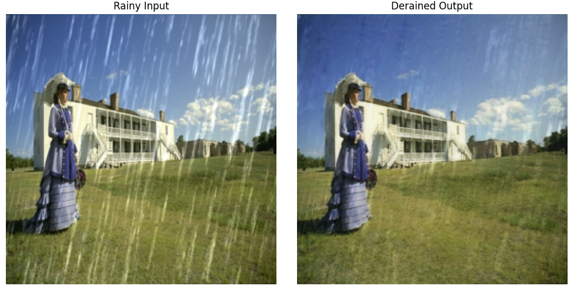
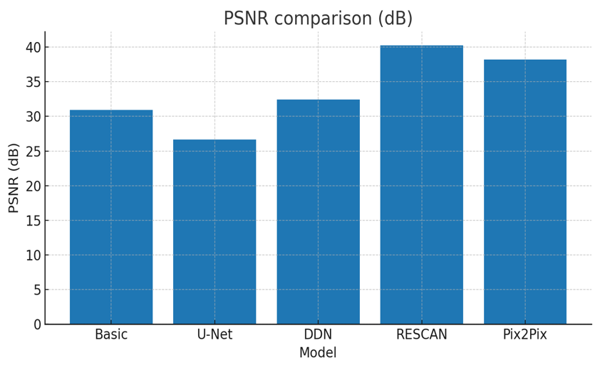
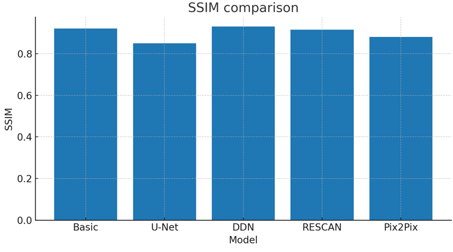

# Image Deraining - Project Overview

   

---

## Objective
**To remove rain streaks and haze from images** using multiple approaches (filtering, CNNs, recurrent networks, and GANs), evaluate them quantitatively (PSNR / SSIM) and qualitatively, and provide reproducible code and sample data.

---

## What is image de-raining?
Image de-raining is the process of removing rain streaks (and associated haze) from images to recover a clean scene. It improves visual quality and aids downstream tasks like segmentation, detection, and tracking.

---

## Models — Summary

| Model | One-line description | Paper | Code |
|---|---|---:|---:|
| **Basic filtering** | Classical median/guided filter baseline for quick denoising. | [Paper](<https://openaccess.thecvf.com/content_cvpr_2016/papers/Li_Rain_Streak_Removal_CVPR_2016_paper.pdf>) | [Code](<https://github.com/TANNU-GITHUB/Image-Deraining/tree/main/Basic%20Filtering>) |
| **U-Net** | Encoder–decoder CNN that learns a direct rainy→clean mapping. | [Paper](<https://arxiv.org/pdf/1505.04597>) | [Code](./U-Net) |
| **DDN** | Deep Detail Network that separates base and detail layers for better rain removal. | [Paper](<https://openaccess.thecvf.com/content_cvpr_2017/papers/Fu_Removing_Rain_From_CVPR_2017_paper.pdf>) | [Code](<https://github.com/TANNU-GITHUB/Image-Deraining/tree/main/Simplified%20DDN>) |
| **RESCAN (modified)** | Recurrent multi-stage network with attention modules, best quantitative performance here. | [Paper](<https://openaccess.thecvf.com/content_ECCV_2018/papers/Xia_Li_Recurrent_Squeeze-and-Excitation_Context_ECCV_2018_paper.pdf>) | [Code](<https://github.com/TANNU-GITHUB/Image-Deraining/tree/main/Modified%20RESCAN>) |
| **Pix2Pix (GAN)** | Conditional GAN performing image-to-image translation (visually sharp results). | [Paper](<https://openaccess.thecvf.com/content_cvpr_2017/papers/Isola_Image-To-Image_Translation_With_CVPR_2017_paper.pdf?utm_source=chatgpt.com>) | [Code](<https://github.com/TANNU-GITHUB/Image-Deraining/tree/main/Pix2Pix%20GAN>) |

---

## Quantitative comparison 
**Metrics used:** PSNR (dB) and SSIM (0–1). 

Here is the performance chart for psnr value:

Here is the performance chart for psnr value:

